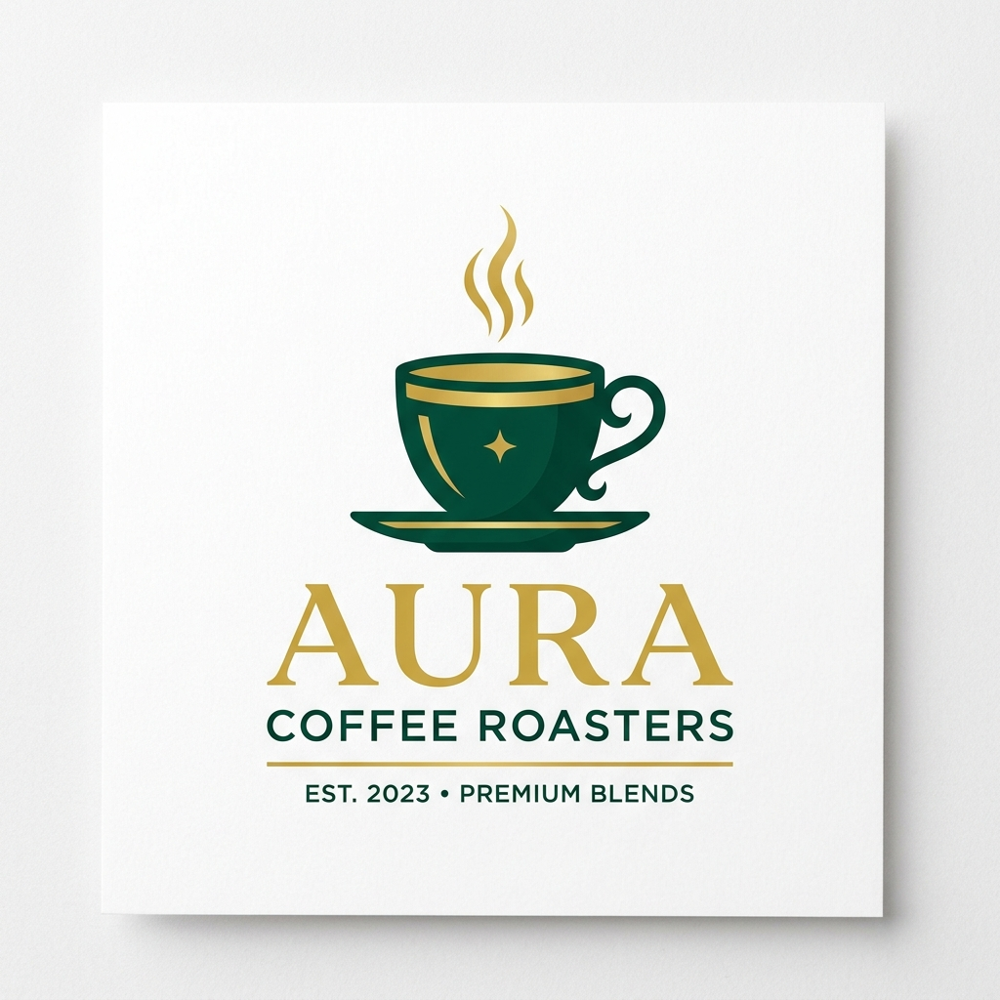

<div align="center">
  
  
  # BrewCraft ☕
  
  **A Premium, Cinematic Coffee Brand Experience**
  
  [Explore the Demo](#) • [Report Bug](#) • [Request Feature](#)
</div>

<br />

BrewCraft is a high-end, luxury coffee brand landing page engineered to deliver an immersive storytelling experience. Inspired by the sleek product pages of Apple and the premium aesthetic of Starbucks Reserve, this project features a buttery smooth, canvas-driven scroll animation that pulls users directly into the art of coffee making.

---

## ✨ Features

- **🎬 Cinematic Canvas Scroll Animation:** Uses a 200-frame image sequence rendered on an HTML5 Canvas, perfectly synced to the user's scroll position for a flawless, interactive storytelling experience.
- **🧈 Buttery Smooth Scrolling:** Powered by **Lenis**, providing a luxurious, fluid scroll sensation across all devices.
- **🎨 Premium Aesthetic:** A curated color palette of deep espresso browns, Starbucks greens, rich creams, and subtle gold accents.
- **🪄 Glassmorphism & Micro-interactions:** Modern UI/UX elements including magnetic custom cursors, glass-pane cards, floating stats, and hover state animations.
- **📱 Fully Responsive:** Carefully crafted layouts that look stunning on massive desktop monitors, tablets, and mobile devices.
- **⚡ Next.js 15 & React:** Blazing fast performance, server-side rendering support, and an optimized preloader.

## 🛠️ Tech Stack

- **Framework:** Next.js (App Router) & React
- **Styling:** Tailwind CSS v4 (Vanilla CSS variables & custom utilities)
- **Animation:** HTML5 Canvas, native `requestAnimationFrame`, CSS Keyframes
- **Scroll:** Lenis Smooth Scroll
- **Typography:** Poppins & Inter (Google Fonts)

## 🚀 Getting Started

To get a local copy up and running, follow these simple steps.

### Prerequisites

You need Node.js installed on your machine.
- npm
  ```sh
  npm install npm@latest -g
  ```

### Installation

1. **Clone the repository**
   ```sh
   git clone https://github.com/your-username/brewcraft.git
   ```
2. **Navigate to the directory**
   ```sh
   cd brewcraft
   ```
3. **Install NPM packages**
   ```sh
   npm install
   ```
4. **Run the development server**
   ```sh
   npm run dev
   ```
5. **Open the App**
   Open [http://localhost:3000](http://localhost:3000) in your browser to experience the site.

## 📂 Project Structure

```text
src/
├── app/
│   ├── globals.css         # Global styles, variables, and animations
│   ├── layout.tsx          # Root layout with fonts, metadata, and Lenis Provider
│   └── page.tsx            # Main page assembly
├── components/
│   ├── Loader.tsx          # Initial frame preloader
│   ├── Navbar.tsx          # Sticky, blurring navigation
│   ├── HeroSection.tsx     # Animated hero with particle effects
│   ├── ScrollCanvas.tsx    # The core HTML5 Canvas scroll animation
│   ├── ExperienceSection.tsx # Glassmorphism features
│   ├── TestimonialsSection.tsx # Infinite auto-scrolling marquee
│   ├── AppPromoSection.tsx # Floating phone mockup & app features
│   └── Footer.tsx          # Elegant footer with newsletter
public/
├── frames/                 # 200 high-res JPG frames for canvas animation
└── coffee.png              # Premium Vector Logo
```

## 🤝 Contributing

Contributions are what make the open source community such an amazing place to learn, inspire, and create. Any contributions you make are **greatly appreciated**.

1. Fork the Project
2. Create your Feature Branch (`git checkout -b feature/AmazingFeature`)
3. Commit your Changes (`git commit -m 'Add some AmazingFeature'`)
4. Push to the Branch (`git push origin feature/AmazingFeature`)
5. Open a Pull Request

## 💎 License

Distributed under the MIT License. See `LICENSE` for more information.

---

<div align="center">
  <i>Crafted with passion, caffeine, and perfect code.</i>
</div>
